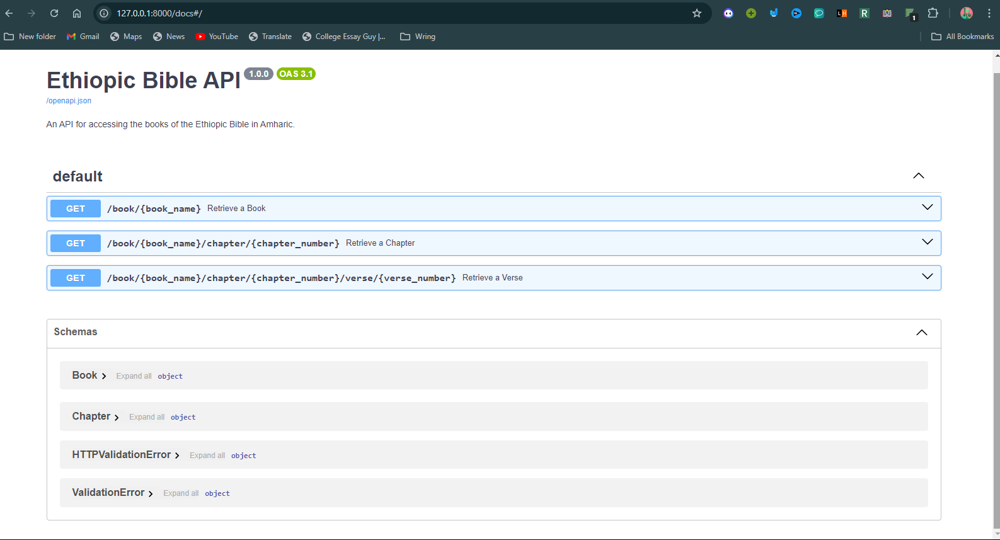

## EthiopicBibleAPI

The  `EthiopicBibleAPI` is an API built with FastAPI that provides access to the Ethiopian Bible in various languages, including Amharic. This API allows developers to programmatically retrieve Bible verses, chapters, and books, enabling seamless integration of Ethiopian Bible texts into applications, websites, and digital platforms. The project is designed to make the Ethiopian Bible more accessible to developers and users around the world.

Key Features:

- Retrieve specific verses, chapters, or entire books from the Ethiopian Bible.
- Support for multiple languages, including Amharic.
- High performance and fast response times, leveraging the power of FastAPI.
- Easy-to-use endpoints for smooth integration into various applications.

# 1. Project Setup
## 1.1 Clone the Repository
```git clone https://github.com/sheshbazzarr/EthiopicBibleAPI.git```

`cd EthiopicBibleAPI`
## 1.2 Set Up a Virtual Environment
  `python -m venv env`
`source env/bin/activate  # On Linux/macOS`
# OR
`env\Scripts\activate  # On Windows`

## 1.3 Install Dependencies
`pip install -r requirements.txt`
